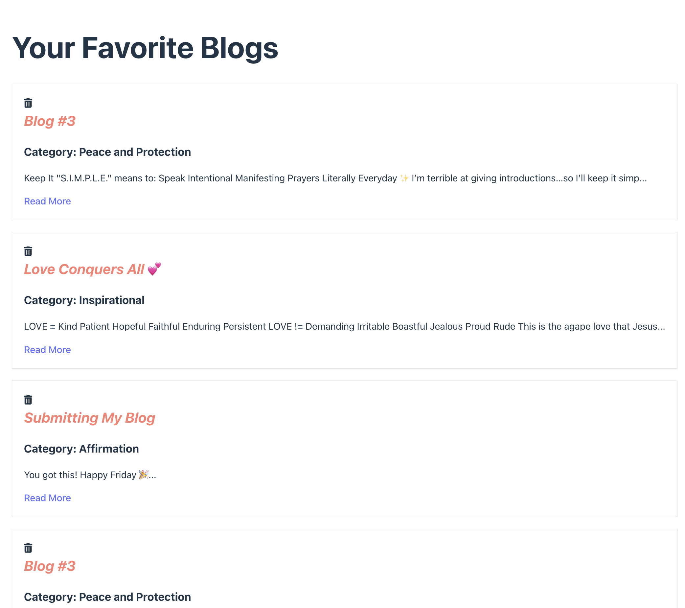

# Blog App (With AI Feature)

**Hi 👋🏾 Thanks for checking out this app! It's designed to allow users to read uplifting blogs and contribute positivity to the space with their own blog or thoughts.** 

# Table of Contents
- [Prerequisites](#first-things-first---what-youll-need)
- [Installation](#installation-instructions)
- [Demo](#demo)

# First Things First - What You'll Need

Prior to running this project, here are the pre-reqs you'll need. Please make sure you've got these installed on your computer:

* **Node.js:** This runs the app. You'll want version 16 or later to keep things smooth.
* **npm** Node Package Manager.
* **PostgreSQL:** This is where we keep all our animal sighting data. Make sure it's up and running! I provide some mock data to get you started in my db.sql file.
* **JEST** For running unit tests.
* Keep in mind I use VS Code for my code editor and a Mac Book.

# Installation Instructions

Here's part one of my installation instructions to get the app running on your machine:

1.  **Grab the Code**

First, you'll need to clone my repo here:

```bash
git clone https://github.com/courjimen/blog-app/tree/main
```

2.  **Get the Server and Client Folders Ready**

Cd into server and run this command: 
```bash
npm install express cors pg nodemon
```

Cd into client and run this command: 
```bash
npm install react react-router-dom @fortawesome/fontawesome-svg-core @fortawesome/free-solid-svg-icons @fortawesome/react-fontawesome
```

Return to root directory and install jest and concurrently run these two commands:

```bash
npm install concurrently --save-dev
npm install jest --save-dev
```

Once everything is installed you can run:

```bash
npm run dev
```

Part two, you'll need to do in your terminal via Postgres 

3. **Set Up the Database Locally with Postgres!**

* **Create a Database:** You'll need to create a PostgreSQL database. Using `psql` to create your tables locally. Sign in (make sure postgres is installed!) with the following command:

```bash
psql postgres
```
Then follow the steps in my `db.sql` file and copy/paste each line of code into your terminal.

* **Insert database credentials:** Open up `server/db.js` and input your database connection details (username, password, etc.).

5.  **Fire It Up! 🔥**

Finally, we're ready to run the app! Back in the main project directory, type:

```bash
npm run dev
```

This will start both the server and the client. You should be able to see the app in your browser at `http://localhost:5173/`. The server will be running on `http://localhost:3000/`.

# Demo
### Here's what you can expect to see upon opening (using the starter code provided for your database in the db.sql file)


### When you're ready to open a blog, click 'Read More' to open the contents of the blog:


### Moving along the nav bar to login and subscribe you will see:
| Login Page | Subscriber Page |
| ------ | ------|
|  | 

### You can also heart the blogs you'd like to bookmark and they will live under 'Favorites':

| Bookmarkerd Blogs | Favorites List |
| ------ | ------|
|  | 

### If you want to add a new blog, click the 'Add New Blog' link at the bottom of the home page:
| Add Form | Dropdown Options |
| ------ | ------|
|  |  | 

### It will display an error if left blank and a success message when your entry is submitted:
| Blank Error ❌ | Success 🎉 | Added |
| ------ | ------| ------|
|  |  | 

### Finally we have an AI feature with Google Translate. As of now, you have to refresh the page to display language options:
| Google Translate | Language Translation |
| ------ | ------|
|  | 

And you're all set 🎉 Thank you for checking out my work.